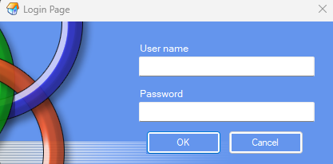
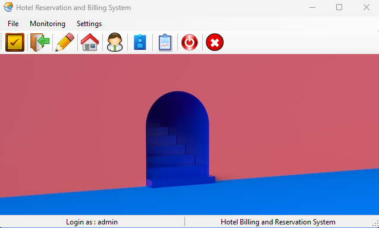

# Hotel Management System

The Hotel Management System is a VB.NET project designed to assist hotel staff with various tasks related to the hotel's daily operations. This system can be used to manage hotel room bookings, track employee data, and monitor customer reservations, as well as many other hotel management tasks.

## Installation

### Requirements
- Windows operating system
- Microsoft Visual Studio 2017 or newer
- Microsoft SQL Server 2012 or newer

### Steps to Install
1. Clone the repository or download the source code as a ZIP file.
2. Open the solution file (.sln) in Microsoft Visual Studio.
3. Build and run the solution.
4. If necessary, create a database in Microsoft SQL Server Management Studio.
5. Configure the database connection string in the project's app.config file.

## Features

### Customer Management
- Add, edit, and delete customer information.
- Search for customers by name or ID.
- View customer details, including their reservation history.

### Room Management
- Add, edit, and delete room information.
- Search for rooms by room number or type.
- View room details, including availability and occupancy status.

### Reservation Management
- Make, edit, and delete customer reservations.
- Search for reservations by customer name or room number.
- View reservation details, including check-in and check-out dates.

### Employee Management
- Add, edit, and delete employee information.
- Search for employees by name or ID.
- View employee details, including their job title and contact information.

### Billing and Payment Management
- Generate customer bills based on their reservation information.
- Accept and process customer payments.
- View and print customer receipts.

### Reporting and Analysis
- View daily, weekly, and monthly reports of hotel operations.
- Analyze occupancy rates and revenue data.
- Track employee productivity and performance.

## Usage
Once the Hotel Management System is installed, follow these steps to use the system:

- Open the application and log in using your credentials.
- Navigate to the appropriate module to perform a task.
- Use the search function to find the relevant customer, room, or reservation information.
- Add, edit, or delete information as necessary.
- Save any changes made.
- Generate customer bills and process payments as needed.
- View reports and analyze data to gain insights into hotel operations.

## Authors

- [@varanofficial](https://github.com/varanofficial)
- [@sho6000](https://github.com/sho6000)


## Installation

Install secondary Assets through VB.NET 2022

```bash
  Imports iTextSharp.text
  Imports iTextSharp.text.pdf
```
    
## License

[MIT](https://choosealicense.com/licenses/mit/)


## Screenshots






## Feedback

If you have any feedback, please reach out to us at uzertechs@gmail.com

